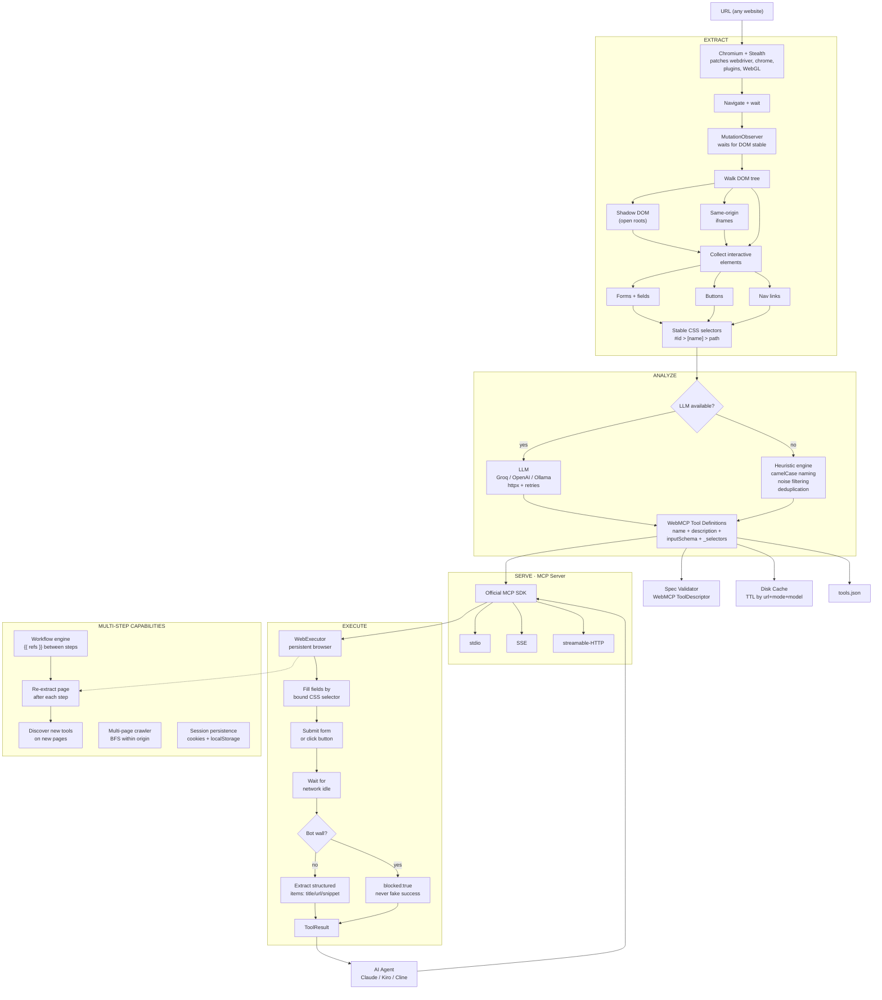
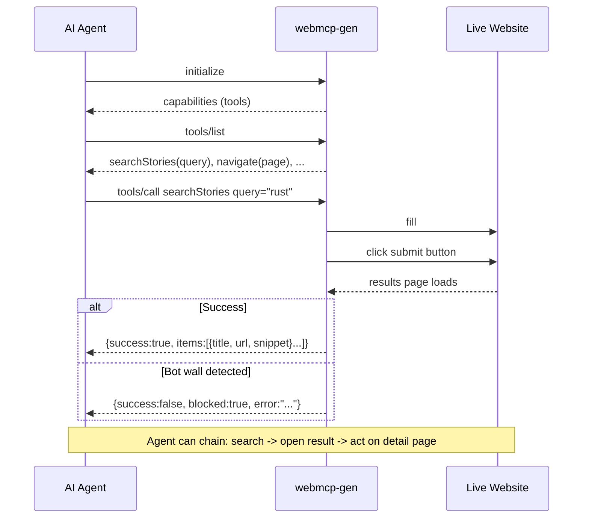

# webmcp-gen

[](https://pypi.org/project/webmcp-gen/)
[](https://pypi.org/project/webmcp-gen/)
[](LICENSE)

**Point it at any website. Get back tools an AI agent can actually call.**

```bash
webmcp-gen https://news.ycombinator.com --groq
```
```json
{
  "tools": [{
    "name": "searchStories",
    "description": "Search Hacker News stories",
    "parameters": {
      "type": "object",
      "properties": { "query": { "type": "string", "description": "e.g. 'rust async'" } },
      "required": ["query"]
    }
  }]
}
```

No site cooperation. No API keys from the site. No OpenAPI spec. You give it a URL,
it drives a real browser, reads the page the way a person would, and writes the
tool definitions an agent needs to use it — and then it can actually run them.

---

## The thing nobody wants to say out loud

There's a clean story everyone tells about AI agents and the web: agents will call
structured tools, websites will expose those tools, everything will be typed and
reliable. Google shipped [WebMCP](https://developer.chrome.com/docs/ai/webmcp) in
Chrome behind a flag to make exactly this happen. It's a genuinely good idea.

Here's the part that's awkward: **adoption is basically zero.** No major site has
implemented it. Standards take years. In the meantime your agent is still doing the
old thing — screenshotting, scraping, clicking at pixel coordinates and praying the
layout didn't change.

So there are two ways to wait for the agentic web:

1. Ask every website on earth to add WebMCP tools. (Good luck.)
2. Generate the tools *for* them, from the outside, today.

webmcp-gen is option 2. It treats the website's own UI — its forms, its buttons,
its nav — as the spec, because it already is one. A search box with a labeled input
and a submit button *is* a `search(query)` tool. Somebody just has to read it and
write it down. That's the whole trick.

---

## How it works



The key design choice is in **ANALYZE**: every parameter carries the CSS selector of
the element it fills. So when the agent later calls `search(query="rust")`, the
executor doesn't guess which box is the search box — it was told. That one decision
is the difference between a demo that works on Google's homepage and something that
holds up on a messy real page.

### Under the hood

A few engineering decisions are what make this hold together, not just demo:

- **Selector bindings, not fuzzy matching.** The analyzer emits a CSS selector per
  parameter. Execution is deterministic — fill *that* element, not "the input that
  looks like search." This is the single biggest reliability lever.
- **Real SPA handling.** Extraction waits on a MutationObserver until the DOM stops
  changing (with a network-idle fallback), instead of a fixed `sleep`. It walks open
  Shadow DOM and same-origin iframes, so component-framework sites aren't invisible.
- **Spec-correct MCP.** The server is built on the official `mcp` SDK, so the stdio /
  SSE / streamable-HTTP handshakes are real — verified by connecting an actual MCP
  client in the test suite, not by hand-rolling JSON-RPC.
- **Structured results.** Tool calls return parsed `items` (title / url / snippet),
  so an agent gets data, not an `innerText` dump it has to re-parse.
- **Honest failure.** A CAPTCHA or challenge page is detected and returned as
  `blocked`, never as a hollow `success`.
- **DOM-clobbering safe.** Reads attributes via `getAttribute`, not properties like
  `form.method`, so a field literally named `method` can't crash extraction — the
  kind of bug that only shows up once you run against dozens of real sites.



---

## Two minutes to your first tools

```bash
pip install webmcp-gen
playwright install chromium

# No API key — heuristic analysis. Crude names, but it runs.
webmcp-gen https://en.wikipedia.org

# With an LLM — real names, real descriptions. This is the good one.
export LLM_API_KEY=gsk_...          # Groq has a free tier
webmcp-gen https://en.wikipedia.org --groq
```

Heuristic vs LLM on the same page is the clearest way to see why the LLM matters:

| | Heuristic | LLM (`--groq`) |
|---|---|---|
| name | `submit(search)` | `searchWikipedia(query)` |
| description | *(none)* | "Search Wikipedia for an article" |

The heuristic sees a form and names it after its submit button. The LLM understands
it's a Wikipedia search and says so. Run the comparison yourself across a handful of
sites:

```bash
python -m webmcp_gen.compare --groq
```

LLM mode speaks any OpenAI-compatible API: Groq (`LLM_API_KEY`), OpenAI
(`OPENAI_API_KEY`), or a local model (`--base-url http://localhost:11434/v1` for
Ollama, no key needed).

---

## Plug it into an agent

webmcp-gen runs as a real [MCP](https://modelcontextprotocol.io) server using the
official SDK, so Claude Desktop, Kiro, Cline, etc. connect with no glue code:

```json
{
  "mcpServers": {
    "hn": {
      "command": "webmcp-serve",
      "args": ["https://news.ycombinator.com", "--groq"]
    }
  }
}
```

The agent connects, calls `tools/list`, and gets clean WebMCP tool definitions. When
it calls one, webmcp-gen fills the form on the live site and hands back **structured
results**, not a wall of scraped text:

```json
{
  "success": true,
  "blocked": false,
  "url": "https://hn.algolia.com/?q=rust",
  "items": [
    { "title": "Rust in the Linux kernel", "url": "https://...", "snippet": "..." },
    { "title": "Why Discord switched to Rust", "url": "https://...", "snippet": "..." }
  ]
}
```

stdio is the default; `--sse` and `--transport streamable-http` are there for
network clients.

---

## When one tool isn't enough

Real tasks are chains: search, open a result, act on it. Each step needs the
previous step's output. Write that as a workflow and reference earlier results with
`{{ }}`:

```json
{
  "url": "https://example.com",
  "variables": { "query": "rust" },
  "steps": [
    { "tool": "search",   "args": { "q": "{{ vars.query }}" },            "save_as": "search" },
    { "tool": "navigate", "args": { "page": "{{ steps.search.items.0.title }}" } }
  ]
}
```

```bash
webmcp-workflow flow.json --groq
```

Between steps the page is re-read, so a tool that only exists on the *next* page —
the "reserve" button you only see after picking a hotel — becomes callable when you
get there.

Two more capabilities worth knowing:

- **Crawl** — one page rarely shows everything a site does. `--crawl` walks the
  origin (bounded BFS), pulls tools from each page, and merges them.
  ```bash
  webmcp-gen https://example.com --crawl --max-pages 5
  ```
- **Login once** — for gated sites, capture a session in a real browser (you type
  the password, not the tool), then reuse it. Cookies are stored `0600`.
  ```bash
  webmcp-login https://github.com/login --session gh
  webmcp-serve https://github.com --session gh
  ```

---

## Does it actually work? Measured, not asserted.

The benchmark ships in the box. It runs the full pipeline against real sites grouped
by difficulty and reports per-tier rates, because "X% success" is meaningless
without saying *which* sites.

```bash
webmcp-benchmark --suite full
```

Latest full run (heuristic mode, stealth on):

| Tier | Meaning | Result |
|---|---|---|
| **sandbox** | sites built for automation | **11 / 12** |
| **open** | public sites, no aggressive detection | 10 / 14 |
| **guarded** | real sites that may throttle/challenge | 7 / 10 |
| **walled** | known hard-blocks | reported `blocked`, never faked |

**81% success across non-walled sites** — and that figure includes successful live
runs against **Google, Amazon, Bing, GitHub, GitLab, Wikipedia, and Startpage**, not
just toy pages. Re-run it any time; the suite is `webmcp_gen/suite.py` and nothing is
hidden.

---

## The honest part: bot detection

Driving a headless browser means some sites will try to stop you. Here's exactly
where webmcp-gen stands, with no spin.

**What it handles.** Headless Chromium leaks tells — `navigator.webdriver` is
`true`, `window.chrome` is missing, the plugin list is empty, WebGL reports a
software renderer. webmcp-gen patches these by default (turn off with
`--no-stealth`). It's the well-understood, dependency-free subset of what
playwright-stealth does, with tests that probe the live signals to prove it — plus a
control test confirming the signals leak *without* it.

**What it doesn't.** Behavioral detection — request timing, TLS fingerprints, IP
reputation, CAPTCHAs — needs residential proxies, TLS spoofing, and CAPTCHA-solving
services. That's a paid, adversarial arms race, and webmcp-gen deliberately doesn't
ship it.

**What it does instead: tells you the truth.** When a site blocks the action, the
result is honest — it never pretends a CAPTCHA page was a successful search:

```json
{ "success": false, "blocked": true,
  "error": "Blocked by anti-bot protection (redirected to '418.html')." }
```

An agent can act on that. A fake `success: true` with garbage results is far worse
than a clear "I was blocked." If you *need* a guarded site: try `--session` (a lot of
"blocks" are really "you're not logged in"), `--headful`, or a friendlier endpoint.

---

## Where webmcp-gen fits

| Tool | What it gives an agent | What it needs from the site |
|---|---|---|
| Playwright MCP | raw click/type primitives | nothing, but no high-level tools |
| Browser Use | an agent that reasons over the DOM | nothing, but the agent does the work |
| WebMCP Gateway | tools the site already declared | the site to implement WebMCP |
| MCP Bridge | a wrapper over a REST/GraphQL API | an OpenAPI spec |
| **webmcp-gen** | **named, typed, runnable tools** | **nothing** |

The gap it fills: high-level tools, generated automatically, from sites that never
opted in.

---

## Use it as a library

Everything the CLI does is importable:

```python
from webmcp_gen import extract_page, analyze_with_llm, WebExecutor

extraction = await extract_page("https://news.ycombinator.com")
analysis   = await analyze_with_llm(extraction, model="llama-3.3-70b-versatile",
                                    base_url="https://api.groq.com/openai/v1")

async with WebExecutor("https://news.ycombinator.com",
                       tools=analysis["tools"], extraction=extraction) as ex:
    result = await ex.call("searchStories", {"query": "rust"})
    print(result.to_dict())
```

CLIs: `webmcp-gen` (generate), `webmcp-serve` (MCP server), `webmcp-workflow`
(chains), `webmcp-login` (sessions), `webmcp-benchmark` (reliability),
`webmcp-compare` (heuristic vs LLM).

---

## Requirements

- Python 3.10+
- `playwright install chromium`
- For LLM mode: Groq (`LLM_API_KEY`, free tier), OpenAI (`OPENAI_API_KEY`), or local
  Ollama (`--base-url`, no key)

## Develop

```bash
pip install -e ".[dev]"
playwright install chromium
pytest                 # unit tests are fast; -k Live hits the network
```

## License

MIT
